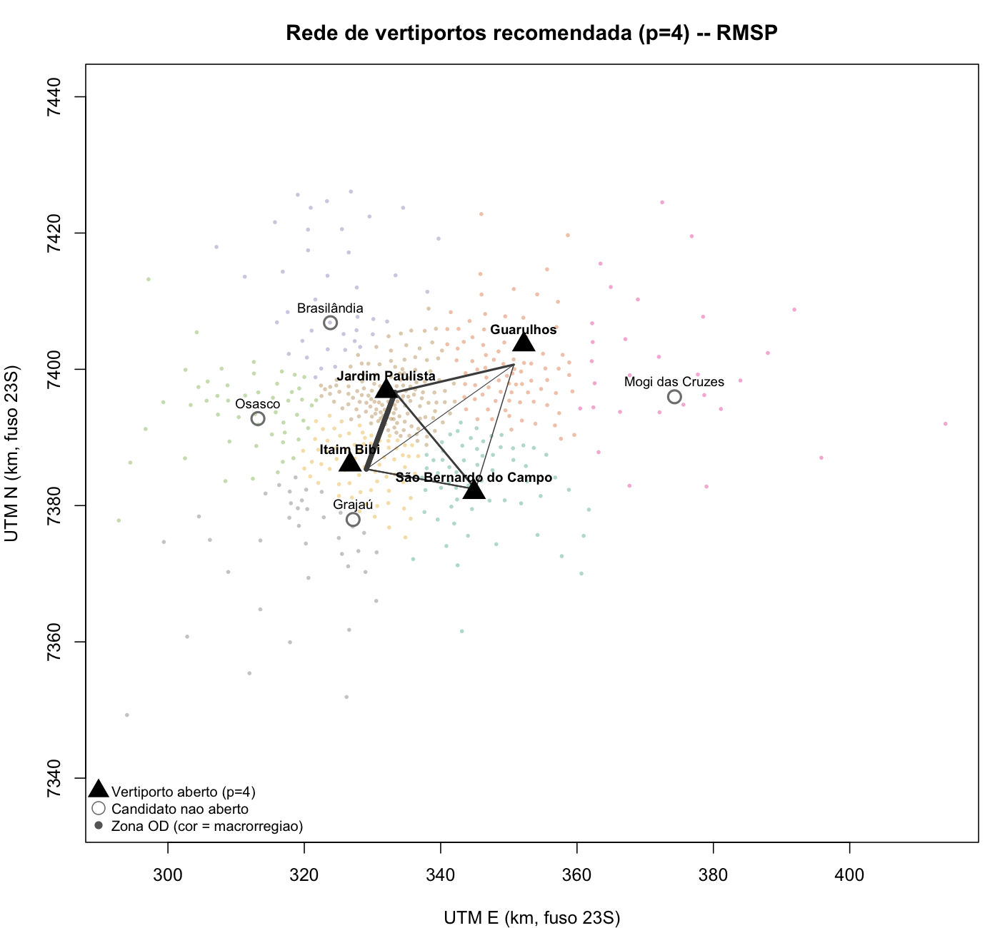
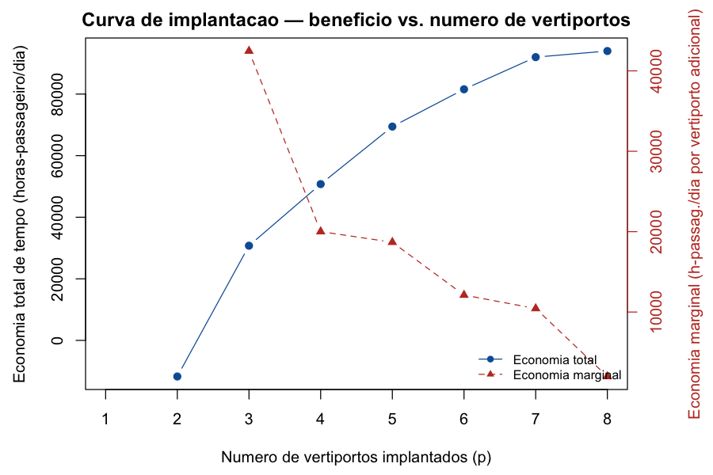

# Localização de vertiportos na Região Metropolitana de São Paulo

**TRA-48 — Inteligência Analítica: Dados, Modelos e Decisões**
**Projeto B1 — Pesquisa Operacional — Instituto Tecnológico de Aeronáutica, 2º semestre de 2026**

Grupo InfraKings — Vitor, Gilberto, Guilherme
Repositório: `github.com/InfraKings/tra48-vertiportos` · Painel de governança: `infrakings.github.io/tra48-vertiportos`
Versão: 2026-09-15 (modelo congelado para o marco de 16/09 — sensibilidade e dual)

---

## Resumo executivo

Formulamos a localização de vertiportos para eVTOL/UAM na RMSP como um
problema de **localização de hubs com alocação múltipla** (não cobertura
nem ranking por demanda), resolvido sobre uma instância reduzida de 8
macrorregiões derivadas das 517 zonas da Pesquisa Origem-Destino 2017 do
Metrô-SP. A rede recomendada para **p = 4 vertiportos** abre hubs em **São
Bernardo do Campo, Guarulhos, Itaim Bibi e Jardim Paulista**, atende
108.404 viagens/dia de demanda estimada como capturável e gera uma
economia de tempo de **50.760 horas-passageiro/dia** frente à alternativa
terrestre. Um achado central e deliberadamente não escondido: **com p = 2
vertiportos a rede é pior que não ter UAM** (economia de tempo negativa),
e a economia só passa a ser positiva a partir de p = 3, com retornos
marginais decrescentes até p = 8. As quatro análises exigidas pelo
enunciado (relaxação linear, dual, sensibilidade e curva de implantação)
foram executadas sobre o modelo real, com números reais — sem nenhum dado
fabricado. O modelo tem limitações explícitas (não captura a opção de
"não voar", é não-capacitado, não endogeniza custo) que estão discutidas
na Seção 8, e uma delas já virou tarefa de acompanhamento registrada na
governança do projeto (ver §8.1).

---

## 1. Contexto e definição do problema

São Paulo concentra a maior operação de helicópteros urbanos do mundo e é
o cenário brasileiro mais evidente de congestionamento crônico de
superfície — e onde operadores de eVTOL (*electric Vertical Take-Off and
Landing*) projetam suas primeiras redes comerciais de Mobilidade Aérea
Urbana (UAM). A pergunta de engenharia deste projeto é direta: **onde
colocar os vertiportos?**

Uma viagem de UAM não é "vertiporto a vertiporto": é uma viagem **porta a
porta**, composta de três trechos —

```
origem → [acesso terrestre] → vertiporto k → [voo] → vertiporto l → [egresso] → destino
```

— da qual decorrem três consequências que o modelo precisa capturar: (i)
o acesso terrestre domina o tempo total (um vertiporto mal localizado
inviabiliza a rota mesmo com voo rápido); (ii) é um problema de
**localização de hubs interdependentes**, não de cobertura simples — o
valor de abrir o vertiporto `k` depende de quais outros vertiportos `l`
estão abertos; (iii) existe massa crítica — um vertiporto isolado não
serve a ninguém.

### 1.1 Recorte metodológico adotado pelo grupo

O grupo decidiu, e registrou na governança do projeto (banco DuckDB,
decisões #2–#10), o seguinte recorte:

- **Critério de otimalidade**: minimizar o tempo total de viagem
  generalizado da demanda capturada (equivalente, a menos de uma
  constante, a maximizar a economia de tempo — ver §5.5 de
  `app/formulacao.md`).
- **Família de formulação**: *p*-hub median não-capacitado de alocação
  múltipla (Campbell, 1994), não cobertura, não p-mediana clássica, não a
  formulação quadrática de alocação única de O'Kelly (1987).
- **Base de demanda**: Pesquisa OD 2017 do Metrô-SP, Tabela 25 (viagens
  por transporte individual motorizado), filtrada por distância mínima,
  renda de origem e uma fração comportamental de adesão `θ`.
- **Candidatos**: helipontos reais registrados na ANAC, um por
  macrorregião.
- **Instância**: reduzida de 517 zonas para 8 macrorregiões (única forma
  de tornar o MILP tratável com o solver disponível, `lpSolve`).

Cada um desses pontos é uma decisão registrada com justificativa e
alternativas descartadas — não um detalhe implícito de implementação (ver
§4 e §6, e o banco de governança).

---

## 2. Revisão de literatura

A literatura de *facility/hub location* oferece famílias clássicas
(cobertura, mediana, custo fixo, hub location, e suas versões
capacitadas). O grupo usou três referências centrais para justificar a
escolha de formulação, e três referências de mercado de UAM para
justificar os parâmetros de demanda:

1. **O'Kelly (1987)** — formulação original de hub location como programa
   quadrático inteiro (alocação única): o custo de servir um par OD
   depende do produto de duas variáveis binárias de alocação, exatamente
   a interdependência que o enunciado exige. Usado para justificar *por
   que* o problema é combinatório — não usamos sua formulação quadrática
   diretamente, pois `lpSolve` não resolve MIQP.
2. **Campbell (1994)** — linearização via alocação múltipla (variáveis
   contínuas de fluxo por par de hubs). É a base direta da formulação
   adotada (§4).
3. **Alumur & Kara (2008)** — survey que classifica as famílias de hub
   location e suas variantes; usado para justificar a escolha específica
   de "*p*-hub median não-capacitado com alocação múltipla" dentre as
   alternativas listadas no enunciado.
4. **Booz Allen Hamilton / NASA (2018)** — estudo de mercado de UAM:
   segmenta a demanda inicial por passageiros de alta disposição a pagar
   (correlacionada com renda) e estima mercado de curto prazo em ~0,5% do
   potencial irrestrito. Fundamenta o filtro de renda e a ordem de
   grandeza de `θ`.
5. **Rimjha & Trani (2021)** — estimativa de demanda de *commuters* para
   UAM, com taxas de captura de poucos pontos percentuais mesmo em
   cenários otimistas. Fundamenta a faixa de sensibilidade de `θ`
   (2%–15%).
6. **Ribeiro et al. (2023)**, *Journal of Air Transport Management* —
   revisão sistemática de métodos de localização de vertiportos, confirma
   que adaptar *facility/hub location* clássico é a corrente dominante.
7. **Small (2012)** — valor do tempo de viagem (VOT); usado apenas para a
   monetização ilustrativa do benefício (§7.4), não para o modelo em si.

Citações completas em `app/literatura.md`.

---

## 3. Dados

### 3.1 Fontes

| Fonte | Origem | Cobertura | Uso no modelo |
|---|---|---|---|
| Pesquisa Origem e Destino 2017 — Metrô-SP | Portal da Transparência Metrô-SP (`transparencia.metrosp.com.br`), Tabelas 1, 6 e 25 + geometria MIF/MID das 517 zonas | RMSP, 39 municípios, 517 zonas, campo em 2017 | Base obrigatória (matriz de viagens, renda, geometria) |
| Helipontos privados — ANAC | Dados Abertos ANAC, lista de aeródromos privados (CSV) | 290 registros na RMSP (192 no município de SP), retrato de 11/09/2020 | Conjunto de candidatos a vertiporto |

Ambas verificáveis por terceiros (URLs completas em
`app/data/raw/FONTES.md`) e registradas no banco de governança
(fontes #1–#2) com origem, formato, cobertura e limitações.

**Limitações reconhecidas** (não escondidas): a OD 2017 tem ~9 anos de
defasagem (inclui o período pós-pandemia, que alterou padrões de
mobilidade) — a Pesquisa OD 2023, mais recente, existe mas não foi
localizada com o mesmo conjunto de tabelas agregadas por zona dentro do
prazo da sessão (decisão #3, a revisitar); a lista ANAC cobre só
helipontos **privados** (não inclui Congonhas) e um heliponto registrado
não implica infraestrutura de vertiporto pronta (recarga elétrica,
terminal de passageiros) — tratamos como proxy de local fisicamente
viável e já licenciado, não como vertiporto pronto (decisão #6).

### 3.2 Estimativa da demanda capturável — a decisão difícil do projeto

A matriz OD completa **não** é demanda de vertiporto. O grupo definiu e
registrou (decisão #7) a seguinte hipótese, combinando três filtros:

1. **Distância mínima** — só pares OD com ≥ 8 km em linha reta entre
   macrorregiões são elegíveis. Abaixo disso, o *overhead* fixo do voo
   (embarque/segurança/taxi, 8 min) e o acesso terrestre dominam qualquer
   ganho do trecho aéreo.
2. **Renda de origem** — só zonas de origem no terço superior de renda
   familiar média (percentil ≥ 66, Tabela 6 OD2017) são elegíveis, como
   proxy de capacidade de pagar uma tarifa premium (Booz Allen
   Hamilton/NASA, 2018).
3. **Fração comportamental `θ`** — 5% das viagens já elegíveis migrariam
   de fato para UAM (cenário "médio prazo", mais otimista que o "curto
   prazo" da NASA, testado entre 2% e 15% na sensibilidade — §7.3).

Resultado: **108.404 viagens/dia** de demanda capturável agregada em uma
matriz 8×8 entre macrorregiões (`app/data/processed/demanda_capturavel.csv`).

---

## 4. Modelo — formulação matemática completa

Formulação completa e comentada em `app/formulacao.md`; reproduzida aqui.

### 4.1 Conjuntos

- `Z` — macrorregiões da RMSP (8), obtidas agregando as 517 zonas OD2017
  por k-means ponderado por viagens produzidas.
- `K, L` — candidatos a vertiporto, **mesmo índice de `Z`**: um candidato
  por macrorregião (heliponto ANAC mais próximo do centroide de demanda).
- Índices: `i, j ∈ Z` (origem/destino da viagem porta-a-porta);
  `k, l ∈ K` (vertiporto de embarque/desembarque), `k ≠ l`.

### 4.2 Parâmetros

| Símbolo | Significado | Unidade | Valor / procedência |
|---|---|---|---|
| `W_ij` | Demanda diária capturável, `i → j` | viagens/dia | Tabela 25 OD2017, filtrada (§3.2) |
| `t^acesso_ik` | Tempo de acesso terrestre `i → k` | h | `fator_sinuosidade · dist(i,k) / v_acesso` |
| `t^voo_kl` | Tempo de voo `k → l` | h | `dist(k,l) / v_cruzeiro + t_overhead` |
| `t^egresso_lj` | Tempo de egresso terrestre `l → j` | h | mesma fórmula do acesso |
| `t0_ij` | Tempo terrestre direto `i → j` (linha de base) | h | `fator_sinuosidade · dist(i,j) / v_acesso` |
| `v_acesso` | Velocidade de acesso/egresso terrestre | km/h | 20 (via arterial congestionada, RMSP) |
| `v_cruzeiro` | Velocidade de cruzeiro do eVTOL | km/h | 200 (Eve/Embraer, única fabricante em certificação ANAC) |
| `t_overhead` | Tempo fixo por voo | h | 8 min |
| `fator_sinuosidade` | Malha viária vs. linha reta | – | 1,3 |
| `θ` | Fração comportamental de adesão | – | 0,05 (base; 0,02–0,15 na sensibilidade) |
| `p` | Número de vertiportos a implantar | inteiro | variado de 1 a 8 |

### 4.3 Variáveis de decisão

- `h_k ∈ {0,1}` — 1 se o candidato `k` é aberto.
- `x_ijkl ∈ [0,1]`, contínua (`k ≠ l`, todo par `(i,j)` com `W_ij > 0`) —
  fração de `W_ij` roteada via embarque em `k`, desembarque em `l`. Não
  precisa ser declarada binária: no ótimo da alocação múltipla
  não-capacitada, ela já assume 0/1 sempre que existe um único par
  `(k,l)` mais barato — confirmado na relaxação linear (§7.1).

### 4.4 Função objetivo

```
min  Σ_(i,j): W_ij>0  Σ_k≠l  W_ij · x_ijkl · (t^acesso_ik + t^voo_kl + t^egresso_lj)
```

Minimiza o tempo total de viagem generalizado da demanda capturada.
Equivalente, a menos de uma constante independente das variáveis
(`Σ W_ij·t0_ij`), a maximizar a economia de tempo — calculada como
métrica derivada pós-solução, sem exigir um segundo modelo.

### 4.5 Restrições

```
(1) Σ_k≠l x_ijkl = 1              ∀(i,j): W_ij > 0
(2) Σ_l≠k x_ijkl ≤ h_k             ∀(i,j): W_ij > 0, ∀k ∈ K
(3) Σ_k≠l x_ijkl ≤ h_l             ∀(i,j): W_ij > 0, ∀l ∈ L
(4) Σ_k h_k = p
(5) x_ijkl ≥ 0 ;  h_k ∈ {0,1}
```

**(1)** toda a demanda capturada é roteada por algum par de vertiportos.
**(2)–(3)** uma rota só usa um vertiporto se ele estiver aberto — é a
restrição que gera a **interdependência exigida pelo enunciado**: o par
`(i,j)` só tem rota barata se **ambos** `k` e `l` estiverem abertos.
**(4)** fixa o número de vertiportos implantados em `p`.

### 4.6 Por que esta formulação, e não outra

Cobertura máxima e p-mediana clássica foram descartadas por não
representarem o trecho hub-a-hub nem o fato de que uma viagem só é
servida se **ambas** as pontas tiverem vertiporto aberto (decisão #4).
A formulação quadrática de alocação única (O'Kelly, 1987) foi descartada
por exigir um solver de MIQP indisponível na sessão — a linearização por
alocação múltipla (Campbell, 1994) resolve o mesmo problema essencial com
`lpSolve` (decisão #4).

---

## 5. Tratabilidade computacional — redução de instância

Uma formulação de hub de alocação múltipla tem `O(|Z|²·|K|²)` variáveis
contínuas. Com as 517 zonas originais isso seria da ordem de `517⁴ ≈
7×10¹⁰` variáveis — inviável para qualquer solver, e em particular para
`lpSolve`, que monta a matriz de restrições **densa** em memória (não é
um solver esparso como CBC/Gurobi/HiGHS).

**Decisão #5**: agregar as 517 zonas em **8 macrorregiões** por k-means
ponderado por viagens produzidas, usando o mesmo conjunto como candidatos
a hub. Testado empiricamente que a matriz densa do `lpSolve` explode em
memória acima de ~10–12 regiões.

Com 8 regiões: 21 pares OD elegíveis (de 56 possíveis, pós-filtro),
`21 × 8×7 = 1.176` variáveis `x_ijkl`, 8 variáveis `h_k`, e
`21 + 21×8 + 21×8 + 1 ≈ 379` restrições — uma matriz de ~1.176×379
(~445 mil células) resolve em frações de segundo, permitindo rodar o
modelo dezenas de vezes (curva de implantação + sensibilidade) dentro do
prazo da sessão.

**Preço da redução**: resolução espacial grosseira — zonas
administrativamente distintas com fluxo relevante entre si podem cair na
mesma macrorregião, escondendo viagens intra-região que poderiam se
beneficiar de UAM. Uma instância mais fina (ex.: distritos/municípios)
exigiria um solver MILP esparso de verdade, fora do escopo desta entrega.

---

## 6. Resultados computacionais

### 6.1 Solução de referência (p = 4)

| Indicador | Valor |
|---|---|
| Vertiportos implantados | 4: São Bernardo do Campo, Guarulhos, Itaim Bibi, Jardim Paulista |
| Demanda total considerada capturável | 108.404 viagens/dia |
| Valor da função objetivo | 66.712,5 horas-passageiro/dia (tempo total generalizado) |
| Economia de tempo vs. linha de base terrestre | 50.760,2 horas-passageiro/dia |
| Gap de otimalidade (MILP) | 0% (ótimo comprovado) |
| Tempo de solução | < 0,1 s (`lpSolve`, instância de 8 macrorregiões) |
| Tamanho da instância | 1.176 variáveis contínuas + 8 binárias; ~379 restrições |

A rede recomendada conecta as quatro regiões de maior massa de demanda
elegível, formando uma malha densa no eixo centro–ABC–Guarulhos (ver mapa,
Figura 1). Os pares de hub mais usados (linhas mais grossas no mapa) são
Itaim Bibi ↔ Jardim Paulista (viagens intrarregião centro-oeste, distância
curta) e São Bernardo do Campo ↔ Guarulhos/Jardim Paulista (viagens de
maior distância, onde o ganho de tempo do trecho aéreo é maior).



### 6.2 Curva de implantação (análise obrigatória #4)

| p | Hubs abertos | Economia de tempo total (h-passageiro/dia) | Economia marginal (h-passageiro/dia) |
|---|---|---|---|
| 1 | — | **inviável** (nenhum par de hub possível) | — |
| 2 | Itaim Bibi, Jardim Paulista | **−11.716,8** | — |
| 3 | + São Bernardo do Campo | 30.752,7 | 42.469,5 |
| 4 | + Guarulhos | 50.760,2 | 20.007,4 |
| 5 | + Osasco | 69.445,4 | 18.685,2 |
| 6 | + Grajaú | 81.557,9 | 12.112,5 |
| 7 | + Brasilândia | 91.998,1 | 10.440,2 |
| 8 | + Mogi das Cruzes | 93.982,4 | 1.984,3 |



**Leitura (achado honesto, não escondido)**: `p = 1` é infactível por
construção — o desenho hub-and-spoke exige `k ≠ l`, logo nenhum voo é
possível com um único vertiporto. Mais revelador: **`p = 2` produz
economia de tempo negativa** — a rede mínima viável força rotas piores do
que ir de carro para parte da demanda, porque o modelo obriga 100% da
demanda elegível a ser roteada pela rede aérea mesmo quando isso é ruim
(ver limitação §8.1). A economia só fica positiva a partir de `p = 3`, e
os retornos marginais caem monotonicamente — o salto de `p=7` para `p=8`
já entrega menos de 2.000 h-passageiro/dia adicionais, uma ordem de
grandeza abaixo do primeiro salto. **Isso sustenta uma recomendação na
faixa de p = 4 a p = 6**: além desse ponto, o ganho marginal por
vertiporto adicional cai para menos de 15% do ganho do primeiro
vertiporto útil, enquanto o custo de implantação (não monetizado aqui,
ver §8.1) certamente não cai na mesma proporção.

### 6.3 Monetização ilustrativa (não é análise de custo-benefício formal)

Convertendo a economia de tempo em `p=4` por um valor do tempo ilustrativo
(40% do salário-hora implícito da renda média das zonas elegíveis, ~R$
4.588/família — Small, 2012): **R$ 388.118/dia**. Esta conversão **não**
inclui excedente do consumidor, custo de oportunidade do capital ou custo
de implantação — é só uma tradução de ordem de grandeza, explicitamente
marcada como ilustrativa no código (`app/scripts/07_experimentos.R`).

### 6.4 Indicadores mínimos comparáveis entre grupos (§6.3 do enunciado)

| Indicador | Valor (p=4, cenário-base) |
|---|---|
| Número de vertiportos implantados e localização | 4 — São Bernardo do Campo, Guarulhos, Itaim Bibi, Jardim Paulista |
| Demanda diária atendida | 108.404 viagens/dia (100% da demanda considerada capturável nesta instância, por construção — ver limitação §8.1) |
| Benefício na métrica própria do grupo | 50.760,2 horas-passageiro/dia de economia de tempo |
| Valor da função objetivo | 66.712,5 horas-passageiro/dia |
| Tamanho da instância | 8 macrorregiões, 1.176 variáveis contínuas + 8 binárias |
| Tempo de solução | < 0,1 s |

---

## 7. Relaxação linear, dual e análise de sensibilidade

### 7.1 Relaxação linear (análise obrigatória #1)

Para todo `p` testado (1 a 8), a relaxação linear (`h_k` contínuo em
[0,1]) produziu o **mesmo valor objetivo** que o MILP, com todas as
variáveis `h_k` já assumindo 0 ou 1 na relaxação — **gap de
integralidade de 0%** em todos os casos.

| p | Objetivo MILP | Objetivo LP relaxado | Gap |
|---|---|---|---|
| 2 | 129.189,4 | 129.189,4 | 0% |
| 3 | 86.719,9 | 86.719,9 | 0% |
| 4 | 66.712,5 | 66.712,5 | 0% |
| 5 | 48.027,2 | 48.027,2 | 0% |
| 6 | 35.914,7 | 35.914,7 | 0% |
| 7 | 25.474,5 | 25.474,5 | 0% |
| 8 | 23.490,2 | 23.490,2 | 0% |

**O que a diferença (zero) revela**: a estrutura da restrição de
cardinalidade `Σh_k = p` combinada com o padrão de custos deste
problema faz com que o ótimo fracionário coincida com um vértice
inteiro do politopo — um resultado conhecido para instâncias pequenas
e sem restrição de capacidade, mas que **não deve ser generalizado**
sem ressalva para instâncias maiores ou capacitadas, onde a
relaxação de hub location tipicamente é fracionária. É um achado
específico desta instância reduzida de 8 regiões, registrado como
tal (experimento #2).

### 7.2 Interpretação econômica do dual (análise obrigatória #2)

Lendo os preços-sombra da relaxação linear em `p = 4` (restrições (2)–(3),
por candidato):

| Candidato | Aberto na relaxação | Preço-sombra (embarque) | Preço-sombra (desembarque) |
|---|---|---|---|
| São Bernardo do Campo | sim | −15.937,1 | −2.748,1 |
| Guarulhos | sim | 0 | −18.685,2 |
| Itaim Bibi | sim | −4.347,8 | −14.337,4 |
| Jardim Paulista | sim | −18.685,2 | 0 |
| Brasilândia | não | 0 | −18.685,2 |
| Mogi das Cruzes | não | 0 | −1.984,3 |
| Osasco | não | 0 | −18.685,2 |
| Grajaú | não | 0 | −18.685,2 |

O dual da restrição de cardinalidade `Σh_k = p` é **−18.685,2
horas-passageiro/dia por vertiporto adicional** — o mesmo valor que
aparece como economia marginal ao passar de `p=4` para `p=5` na curva de
implantação (§6.2), como esperado pela teoria de dualidade. **Leitura em
linguagem de decisão**: o recurso mais escasso do modelo não é nenhum
candidato específico — é o próprio **número de vertiportos permitido**
(`p`). Cada unidade adicional de `p` vale, no ótimo local em torno de
`p=4`, quase 18.700 horas-passageiro/dia — o que só faz sentido investir
em abrir mais um vertiporto se o custo de implantação for inferior ao
valor monetizado dessa economia (ver §6.3 e a limitação de custo não
endogenizado em §8.1). Entre os hubs já abertos, Jardim Paulista e
Guarulhos têm o maior preço-sombra em um dos dois sentidos (embarque e
desembarque, respectivamente) — são os vértices mais "espremidos" da
rede, cuja capacidade adicional (se o modelo fosse capacitado) valeria
mais relaxar primeiro.

### 7.3 Análise de sensibilidade (análise obrigatória #3)

Onze cenários, variando um parâmetro de cada vez a partir do cenário-base
(`θ=5%`, `v_acesso=20 km/h`, `d_min=8 km`, corte de renda no percentil 66,
`p=4` fixo):

| Cenário | Parâmetro alterado | Demanda (viagens/dia) | Economia de tempo (h-passageiro/dia) | Hubs abertos mudam? |
|---|---|---|---|---|
| base | — | 108.404 | 50.760,2 | — |
| θ=2% | fração de adesão | 43.362 | 20.304,1 | não |
| θ=10% | fração de adesão | 216.808 | 101.520,4 | não |
| θ=15% | fração de adesão | 325.212 | 152.280,5 | não |
| v_acesso=15 km/h | velocidade terrestre | 108.404 | 75.149,2 | não |
| v_acesso=25 km/h | velocidade terrestre | 108.404 | 36.126,8 | não |
| v_acesso=30 km/h | velocidade terrestre | 108.404 | 26.371,2 | não |
| d_min=5 km | distância mínima elegível | 108.404 | 50.760,2 | não |
| d_min=12 km | distância mínima elegível | 108.404 | 50.760,2 | não |
| renda_pctl=50% | corte de renda | 124.817 | 64.136,0 | **sim** (Osasco entra no lugar de Guarulhos) |
| renda_pctl=80% | corte de renda | 89.312 | 35.135,4 | **sim** (Osasco entra no lugar de São Bernardo do Campo) |

**Leitura em linguagem de decisão**:

- `θ` escala a demanda e a economia **linearmente**, como esperado (é uma
  fração fixa aplicada à mesma matriz de pares elegíveis) — não muda a
  rede ótima, só a magnitude do benefício. É o parâmetro para o qual o
  resultado é mais sensível em termos absolutos, e é também o que tem
  menos fundamento empírico direto (é uma estimativa de mercado, não um
  dado medido) — maior risco de o número final estar errado por um fator
  multiplicativo.
- `v_acesso` tem efeito **inversamente proporcional** ao tempo de acesso
  (confirma que "o acesso terrestre domina", §1): entre 15 km/h e 30
  km/h, a economia de tempo cai de 75.149 para 26.371 h-passageiro/dia —
  quase 3× de variação para uma faixa razoável de incerteza sobre a
  velocidade real de trânsito na RMSP. É o parâmetro que mais merece
  investigação futura com dado de fonte primária (CET-SP), pois hoje é
  uma estimativa de ordem de grandeza, não uma medição.
- `d_min` (distância mínima elegível) **não teve efeito nenhum** entre 5
  km e 12 km — achado honesto que expõe uma limitação da agregação em 8
  macrorregiões: nesta escala grosseira, todos os pares de macrorregiões
  já estão a mais de 12 km de distância entre si, então o filtro nunca é
  o fator limitante. Em uma instância mais fina (distritos), este
  parâmetro provavelmente seria ativo.
- O corte de renda é o **único parâmetro que muda a rede ótima**: no
  percentil 50 e no percentil 80, Osasco substitui, respectivamente,
  Guarulhos e São Bernardo do Campo entre os 4 hubs abertos. Isso mostra
  que a hipótese de demanda capturável (§3.2) não é um detalhe cosmético
  — ela pode mudar a recomendação de *onde* implantar, não só de *quanto*
  benefício esperar.

### 7.4 Interações com IA registradas nesta camada (declaração obrigatória, §5.6)

Três interações com IA foram registradas no banco de governança do
projeto (`./gov ia`), todas com aceite **parcial**, nunca integral:

1. **Formulação** — crítica: o modelo força 100% da demanda elegível a
   ser roteada pela rede aérea mesmo quando a rota é pior que ir de carro
   (achado explícito de `p=2`, §6.2). Resolver exigiria uma opção de
   "não-voar" endógena no MILP, deixada como trabalho futuro (tarefa
   registrada, prazo 16/09).
2. **Código** — crítica: o parser de geometria MIF e a projeção UTM
   próprios (escritos para evitar dependência de `sf`/`rgdal`) não foram
   validados independentemente contra uma biblioteca de geoprocessamento
   de referência nem contra pontos de controle conhecidos.
3. **Análise** — crítica: os cenários de sensibilidade e o ponto-base
   foram escolhidos pela própria IA, sem validação externa contra
   estudos independentes de dimensionamento de rede UAM em São Paulo, e
   os resultados numéricos ainda não foram revisados por um integrante
   humano do grupo.

---

## 8. Limitações do modelo e trabalhos futuros

### 8.1 O que ficou de fora, e por que isso é (por ora) aceitável

- **Sem opção de "não capturar"**: a restrição (1) força toda a demanda
  elegível a ser roteada pela rede — mesmo quando a rota aérea é pior que
  a terrestre. É a causa direta do achado de `p=2` com economia negativa
  (§6.2) e da crítica de IA #1 (§7.4). **Já é tarefa registrada** na
  governança (prazo 16/09): estender o MILP com um arco de "não-captura"
  cujo custo seja a alternativa terrestre, tornando a demanda servida uma
  variável de decisão, não um dado forçado.
- **Sem capacidade por vertiporto** (modelo *uncapacitated*): aceitável
  para a primeira camada de localização, que precede o dimensionamento
  operacional; extensão natural é `Σ_ij Σ_l x_ijkl·W_ij ≤ Cap_k`.
- **Sem custo fixo de implantação**: nenhuma fonte pública confiável de
  custo de vertiporto eVTOL no Brasil foi localizada no prazo da sessão;
  `p` é tratado como parâmetro exógeno, e a curva de implantação (§6.2)
  permite ao leitor aplicar seu próprio custo marginal para decidir onde
  parar.
- **Elasticidade de tarifa/renda**: `θ` é uma fração fixa, não um modelo
  de escolha de modo sensível a preço — uma abordagem logit seria mais
  defensável, mas exigiria dados de tarifa e valor do tempo por segmento
  que não temos.
- **Congestionamento de espaço aéreo / regras DECEA**: fora de escopo —
  problema operacional subsequente à decisão de localização.
- **Velocidade terrestre única para acesso e para a linha de base**: usa
  o mesmo `v_acesso` no trecho de acesso/egresso e na viagem direta de
  referência, o que **subestima** a velocidade real da viagem direta em
  trajetos longos (que usariam vias expressas) — ou seja, o modelo tende
  a **superestimar o benefício de tempo da UAM** para pares OD distantes.
- **Instância reduzida a 8 macrorregiões**: perde resolução espacial fina
  (§5); em particular, isso já se manifestou na insensibilidade do filtro
  de distância mínima (§7.3).
- **Geometria própria não validada** (crítica de IA #2, §7.4).

### 8.2 Trabalhos futuros priorizados

1. Estender o MILP com opção de não-captura endógena (tarefa registrada).
2. Validar o parser MIF/projeção UTM contra `sf` ou pontos de controle.
3. Revisitar a Pesquisa OD 2023 como possível substituta da OD 2017.
4. Testar uma instância mais fina (distritos/municípios) com um solver
   MILP esparso (CBC/HiGHS), fora do `lpSolve`.
5. Buscar fonte de custo de implantação de vertiporto para endogenizar
   `p` via função objetivo.

---

## 9. Referências

1. O'Kelly, M.E. (1987). *A quadratic integer program for the location of
   interacting hub facilities.* European Journal of Operational Research,
   32(3), 393–404.
2. Campbell, J.F. (1994). *Integer programming formulations of discrete
   hub location problems.* European Journal of Operational Research,
   72(2), 387–405.
3. Alumur, S., & Kara, B.Y. (2008). *Network hub location problems: The
   state of the art.* European Journal of Operational Research, 190(1),
   1–21.
4. Booz Allen Hamilton / NASA (2018). *Urban Air Mobility (UAM) Market
   Study.* NASA NTRS 20190001472.
5. Rimjha, M., & Trani, A. (2021). *Commuter demand estimation and
   feasibility assessment for Urban Air Mobility in Northern California.*
6. Ribeiro, N. et al. (2023). *New infrastructures for Urban Air Mobility
   systems: A systematic review on vertiport location and capacity.*
   Journal of Air Transport Management.
7. Small, K.A. (2012). *Valuation of travel time.* Economics of
   Transportation, 1(1–2), 2–14.
8. Metrô-SP. *Pesquisa Origem e Destino 2017.* Portal da Transparência,
   `transparencia.metrosp.com.br`.
9. ANAC. *Dados Abertos — Lista de Aeródromos Privados (Helipontos).*
   `anac.gov.br/acesso-a-informacao/dados-abertos`.

---

## Reprodutibilidade

Todo o pipeline (dados brutos → dados tratados → modelo → resultados →
figuras) roda do zero com um único comando, a partir da raiz do
repositório:

```bash
Rscript app/scripts/run_all.R
Rscript app/scripts/08_mapa.R
```

Pré-requisitos: R com os pacotes `lpSolve` e `readxl`. Sem dependência de
`sf`/`rgdal` (decisão registrada, §5 e `app/scripts/00_utils.R`).
Rastreabilidade completa de cada decisão, fonte, experimento e interação
de IA no banco de governança (`governanca/projeto.duckdb`) e no painel
publicado (`infrakings.github.io/tra48-vertiportos`).
